<!-- Generated by scripts/gen-doc-graphs.ts - do not edit by hand.
     Run `pnpm run gen-doc-graphs` to regenerate. -->

# ACP Automation App Composition

The ACP demo exposes fresh baseline-prompt agent sessions to programmatic clients over JSON-RPC stdio, with no stdout logger, human UI, or pre-created agent.

```mermaid
flowchart LR
  cfg["examples/acp-agent<br/>cordis.yml"]
  plugin_acp_llm_deepseek["llm-deepseek<br/>@open-harness/oh-llm-deepseek"]
  cfg --> plugin_acp_llm_deepseek
  plugin_acp_sandbox["sandbox<br/>@open-harness/oh-sandbox-local"]
  cfg --> plugin_acp_sandbox
  plugin_acp_sandbox_policy["sandbox-policy<br/>@open-harness/oh-sandbox-policy"]
  cfg --> plugin_acp_sandbox_policy
  plugin_acp_subprocess["subprocess<br/>@open-harness/oh-subprocess-local"]
  cfg --> plugin_acp_subprocess
  plugin_acp_bash["bash<br/>@open-harness/oh-bash-sandbox"]
  cfg --> plugin_acp_bash
  plugin_acp_approval["approval<br/>@open-harness/oh-user-approval"]
  cfg --> plugin_acp_approval
  plugin_acp_acp_agent["acp-agent<br/>@open-harness/oh-acp-demo"]
  cfg --> plugin_acp_acp_agent
  plugin_acp_acp_agent --> bundle_agent_core["@open-harness/oh-agent-spine-demo"]
  plugin_acp_acp_agent --> bundle_jsonl["@open-harness/oh-session-persistence-jsonl"]
  plugin_acp_acp_agent --> entrypoint_acp["@open-harness/oh-acp<br/>automation-only JSON-RPC stdio<br/>fresh sessions created by client"]
  bundle_agent_core --> spine_llm["ctx.llm"]
  bundle_agent_core --> spine_sessions["ctx.sessions"]
  bundle_agent_core --> spine_tools["ctx.tools + tool-bash"]
  bundle_agent_core --> spine_loop["ctx.agents + ctx.agentLoop"]
  plugin_acp_token_meter["token-meter<br/>@open-harness/oh-token-meter"]
  cfg --> plugin_acp_token_meter
  plugin_acp_compaction_basic["compaction-basic<br/>@open-harness/oh-compaction-basic"]
  cfg --> plugin_acp_compaction_basic
  plugin_acp_session_projection["session-projection<br/>@open-harness/oh-session-projection"]
  cfg --> plugin_acp_session_projection
  plugin_acp_subagent["subagent<br/>@open-harness/oh-subagent"]
  cfg --> plugin_acp_subagent
  plugin_acp_subagent_spawn_in_process["subagent-spawn-in-process<br/>@open-harness/oh-subagent-spawn-in-process"]
  cfg --> plugin_acp_subagent_spawn_in_process
  plugin_acp_subagent_fork_in_process["subagent-fork-in-process<br/>@open-harness/oh-subagent-fork-in-process"]
  cfg --> plugin_acp_subagent_fork_in_process
  plugin_acp_tool_subagent_control["tool-subagent-control<br/>@open-harness/oh-tool-subagent-control"]
  cfg --> plugin_acp_tool_subagent_control
  plugin_acp_tool_subagent_list_agents["tool-subagent-list-agents<br/>@open-harness/oh-tool-subagent-control/list-agents"]
  cfg --> plugin_acp_tool_subagent_list_agents
  plugin_acp_tool_subagent_report["tool-subagent-report<br/>@open-harness/oh-tool-subagent-report"]
  cfg --> plugin_acp_tool_subagent_report
  plugin_acp_tool_subagent["tool-subagent<br/>@open-harness/oh-tool-subagent"]
  cfg --> plugin_acp_tool_subagent
  plugin_acp_tool_subagent_fork["tool-subagent-fork<br/>@open-harness/oh-tool-subagent"]
  cfg --> plugin_acp_tool_subagent_fork
  plugin_acp_workflow_worker_thread["workflow-worker-thread<br/>@open-harness/oh-workflow-worker-thread"]
  cfg --> plugin_acp_workflow_worker_thread
  plugin_acp_tool_workflow["tool-workflow<br/>@open-harness/oh-tool-workflow"]
  cfg --> plugin_acp_tool_workflow
  plugin_acp_tool_ralph["tool-ralph<br/>@open-harness/oh-tool-ralph"]
  cfg --> plugin_acp_tool_ralph
  plugin_acp_tool_todo["tool-todo<br/>@open-harness/oh-tool-todo"]
  cfg --> plugin_acp_tool_todo
  plugin_acp_repeat_tool_reminder["repeat-tool-reminder<br/>@open-harness/oh-repeat-tool-reminder"]
  cfg --> plugin_acp_repeat_tool_reminder
  plugin_acp_fs_sandbox["fs-sandbox<br/>@open-harness/oh-fs-sandbox"]
  cfg --> plugin_acp_fs_sandbox
  plugin_acp_fs_observation_policy["fs-observation-policy<br/>@open-harness/oh-fs-observation-policy"]
  cfg --> plugin_acp_fs_observation_policy
  plugin_acp_tool_fs["tool-fs<br/>@open-harness/oh-tool-fs"]
  cfg --> plugin_acp_tool_fs
  plugin_acp_hooks_claude_code["hooks-claude-code<br/>@open-harness/oh-hooks-claude-code"]
  cfg --> plugin_acp_hooks_claude_code
  plugin_acp_hooks_codex["hooks-codex<br/>@open-harness/oh-hooks-codex"]
  cfg --> plugin_acp_hooks_codex
```

| Plugin id | Package / module |
| --- | --- |
| `llm-deepseek` | `@open-harness/oh-llm-deepseek` |
| `sandbox` | `@open-harness/oh-sandbox-local` |
| `sandbox-policy` | `@open-harness/oh-sandbox-policy` |
| `subprocess` | `@open-harness/oh-subprocess-local` |
| `bash` | `@open-harness/oh-bash-sandbox` |
| `approval` | `@open-harness/oh-user-approval` |
| `acp-agent` | `@open-harness/oh-acp-demo` |
| `token-meter` | `@open-harness/oh-token-meter` |
| `compaction-basic` | `@open-harness/oh-compaction-basic` |
| `session-projection` | `@open-harness/oh-session-projection` |
| `subagent` | `@open-harness/oh-subagent` |
| `subagent-spawn-in-process` | `@open-harness/oh-subagent-spawn-in-process` |
| `subagent-fork-in-process` | `@open-harness/oh-subagent-fork-in-process` |
| `tool-subagent-control` | `@open-harness/oh-tool-subagent-control` |
| `tool-subagent-list-agents` | `@open-harness/oh-tool-subagent-control/list-agents` |
| `tool-subagent-report` | `@open-harness/oh-tool-subagent-report` |
| `tool-subagent` | `@open-harness/oh-tool-subagent` |
| `tool-subagent-fork` | `@open-harness/oh-tool-subagent` |
| `workflow-worker-thread` | `@open-harness/oh-workflow-worker-thread` |
| `tool-workflow` | `@open-harness/oh-tool-workflow` |
| `tool-ralph` | `@open-harness/oh-tool-ralph` |
| `tool-todo` | `@open-harness/oh-tool-todo` |
| `repeat-tool-reminder` | `@open-harness/oh-repeat-tool-reminder` |
| `fs-sandbox` | `@open-harness/oh-fs-sandbox` |
| `fs-observation-policy` | `@open-harness/oh-fs-observation-policy` |
| `tool-fs` | `@open-harness/oh-tool-fs` |
| `hooks-claude-code` | `@open-harness/oh-hooks-claude-code` |
| `hooks-codex` | `@open-harness/oh-hooks-codex` |

Source config: [`examples/acp-agent/cordis.yml`](cordis.yml).

Maintenance mode: hybrid: the leaf plugin list is parsed from its `cordis.yml`; app package expansion is curated from package source.
